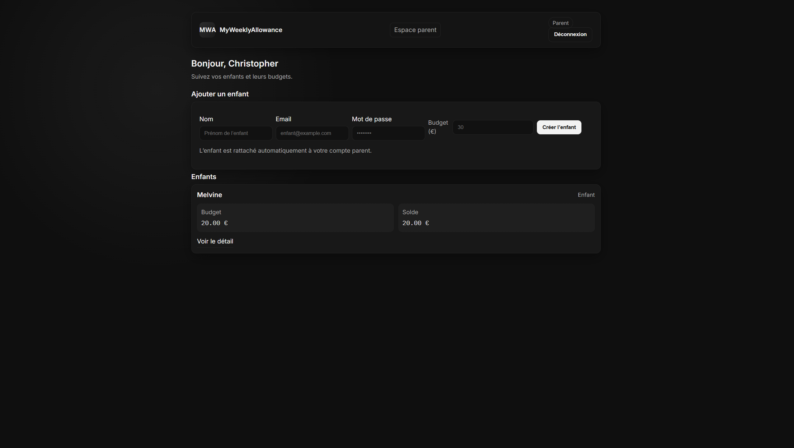

# MyWeeklyAllowance — module d'argent de poche (TDD)


## Rappel de l'exercice
Objectif : concevoir un module de gestion d'argent de poche pour adolescents en TDD.
- Phase 1 : ecrire les tests unitaires (RED)
- Phase 2 : coder l'implementation jusqu'a passage des tests (BLUE)
- Phase 3 : refactoriser (GREEN)
- Phase 4 : verifier la couverture

Fonctionnalites attendues :
- creer un compte pour un ado
- deposer de l'argent
- enregistrer des depenses
- fixer une allocation hebdomadaire automatique

## Stack et prerequis
- Docker + Docker Compose
- PHP 8.3 (dans le conteneur), Composer, PHPUnit 12
- Xdebug integre pour la couverture

## Demarrer le projet
```bash
docker compose up -d --build
docker compose exec app composer install
```

## Lancer les tests
- Tous les tests :  
  `docker compose exec app ./vendor/bin/phpunit --bootstrap vendor/autoload.php tests`
- Fichier cible :  
  `docker compose exec app ./vendor/bin/phpunit --bootstrap vendor/autoload.php tests/Domain/WeekTest.php`
- Couverture texte :  
  `docker compose exec app env XDEBUG_MODE=coverage ./vendor/bin/phpunit --coverage-text`
- Couverture HTML :  
  `docker compose exec app env XDEBUG_MODE=coverage ./vendor/bin/phpunit --coverage-html coverage`

## Structure rapide
- `src/Domain` : entites (Week, Expense, User) + regles metier
- `src/Application` : use cases (ApplyWeeklyAllowance, AddExpenseToWeek, DepositToWeek, GetWeekSummary) + DTO
- `src/Infrastructure` : conteneur, persistance InMemory et PDO
- `tests/Domain`, `tests/Application`, `tests/Integration` : tests TDD et doubles in-memory

## Fonctionnalites bonus / extra
- Authentification simple : inscription parent, login parent/enfant, gestion de session et bouton de deconnexion (protégé par token CSRF).
- Navigation role-aware : la navbar affiche uniquement les vues pertinentes selon l'etat (guest, enfant, parent) + etat actif.
- Clean architecture : separation Domain / Application / Infrastructure, conteneur d'injection minimal (`src/Infrastructure/Container.php`) et repositories in-memory + PDO.
- Styles factorises : variables CSS, composants (cards, pills, boutons, alerts) et responsive navbar
- Couverture de tests renforcee : tests unitaires et d'integration (fakes in-memory) couvrant use cases, entites et repositories.
